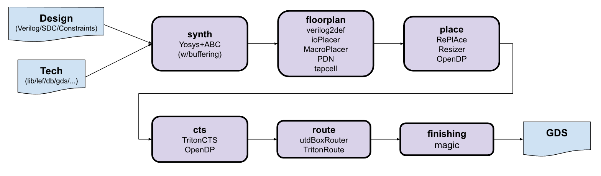

## Testing Layout


## Running the Flow
1. Clone the repository
```
git clone https://github.com/The-OpenROAD-Project/alpha-release
cd alpha-release/flow
```
2. An OpenROAD release must be setup to run the tests. More info in the build [README](../build/README.md)
3. Update the top of the Makefile to point to a design configuration file. Sample desgin configurations are available in the `designs` directory.
4. Run `make` to peform verilog to gds


## Customizing for designs
The flow runs all of the steps sequentially to achieve Verilog to GDS. There is an initial platform setup required in order to use the OpenROAD flow. This has already been performed for the FreePDK45, Nangate45 and TSMC65(under NDA so not in the alpha-release git repository) platforms. See sample platforms setup in the `platforms` directory.

Once the platform is setup. Create a new design configuration with information about the design.  See sample configurations in the `design` directory

Also refer to the [known issues and limitations documents](docs/Known%20Issues%20and%20Limitations.pdf) for information on conditioning your design/files for the flow
